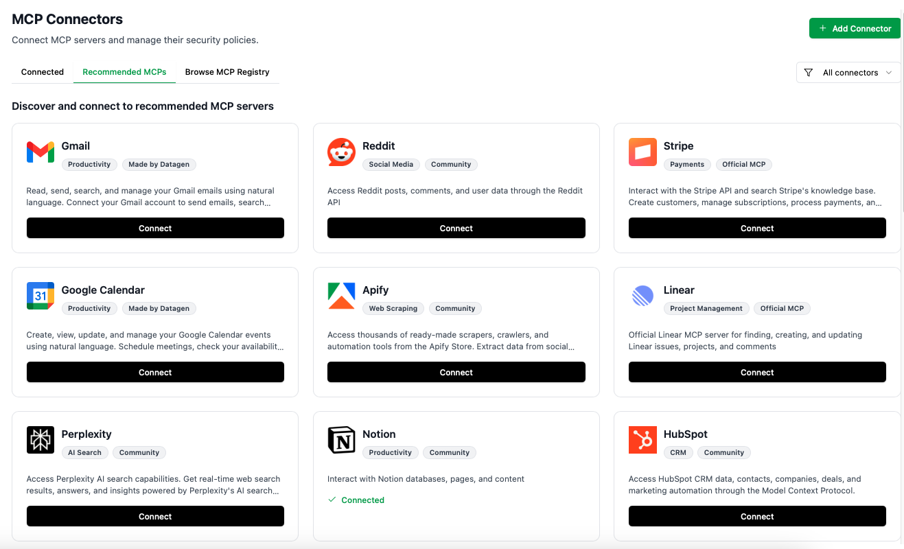

# datagen-python-sdk

Built for AI coding assistants and developers. DataGen's MCP server lets AI agents discover and understand how to use any integrated tool - Gmail, Linear, Supabase, Slack - without hardcoded integration knowledge. Agents use `searchTools` and `getToolDetails` to self-guide, writing clean `client.execute_tool()` code that skips SDK hell, OAuth nightmares, and API integration boilerplate.

## Key Features

- **MCP Tools as Code**: Turn any MCP tool into executable code - no SDK installation, no API wrappers
- **Skip Integration Hell**: No Gmail SDK, no LinkedIn API wrappers, no OAuth configuration code
- **One Client for Everything**: Access Gmail, Linear, Supabase, Slack - same simple pattern
- **MCP Gateway**: Unified authentication for all connected MCP servers. You don't need to handle auth during the code generation process.
- **MCP Middleware**: Built-in retry logic and rate-limit handling across all your API calls 

## AI Agent-First Design

DataGen is built for AI coding assistants (Claude, Cursor, Copilot, etc.) to discover and use tools without hardcoded knowledge.


*DataGen's MCP Gateway architecture - one client handles auth and routing to Gmail, Supabase, LinkedIn. Write simple execute_tool() calls, skip all SDK setup*

### The Agent Discovery Workflow

**Step 1: Agent discovers available tools**
```
Agent calls searchTools MCP tool:
Input: "send email"
Output: ['mcp_Gmail_gmail_send_email', 'mcp_Resend_send_email', ...]
```

**Step 2: Agent learns tool schema**
```
Agent calls getToolDetails MCP tool:
Input: "mcp_Gmail_gmail_send_email"
Output: {
  "name": "mcp_Gmail_gmail_send_email",
  "inputSchema": {
    "properties": {
      "to": {"type": "string"},
      "subject": {"type": "string"},
      "body": {"type": "string"}
    }
  }
}
```

**Step 3: Agent writes clean code**
```python
client.execute_tool(
    "mcp_Gmail_gmail_send_email",
    {
        "to": user.email,
        "subject": "Welcome!",
        "body": f"Hi {user.name}, thanks for signing up!"
    }
)
```

### How DataGen Transforms AI-Assisted Development

DataGen's MCP + SDK combo dramatically improves agent-assisted coding by eliminating the gap between "what you want" and "working code."

**🎯 The AI-Assisted Experience:**

Just tell your AI agent: *"Send an email to new signups from the database"*

The agent instantly:
1. **Self-discovers tools** via MCP (`searchTools` finds `mcp_Supabase_run_sql`, `mcp_Gmail_gmail_send_email`)
2. **Learns schemas** via MCP (`getToolDetails` gets exact parameters needed)
3. **Writes clean code** using the SDK (`client.execute_tool()` calls)
4. **Executes immediately** - no OAuth, no API key setup, no SDK installation, no API docs hunting

**Traditional AI-Assisted Development Problems:**
- ❌ Agent generates Gmail SDK boilerplate → you fix OAuth errors for 30 minutes
- ❌ Agent hallucinates API parameters → you debug incorrect field names
- ❌ Agent imports wrong packages → you install 5 SDKs and resolve conflicts
- ❌ You iterate 10+ times to get working integration code

**DataGen AI-Assisted Development Reality:**
- ✅ Agent self-discovers real tools and schemas → generates correct code first try
- ✅ Zero OAuth & API key configuration → authentication handled by MCP Gateway
- ✅ One SDK for everything → no package conflicts or version hell
- ✅ You iterate on business logic, not integration plumbing

**The Result:** Go from idea → working integration in one prompt instead of one hour.

### Real-World Integration Comparison

**Task:** Send welcome emails and Slack notifications for new database signups

**Without DataGen - Multiple packages, credential management, service-specific boilerplate:**
```python
from google.oauth2.credentials import Credentials
from googleapiclient.discovery import build
from email.mime.text import MIMEText
import base64, psycopg2, os
from slack_sdk import WebClient

# OAuth & service setup
creds = Credentials.from_authorized_user_file('token.json', SCOPES)
gmail = build('gmail', 'v1', credentials=creds)
slack = WebClient(token=os.getenv("SLACK_TOKEN"))

# Database connection & query
conn = psycopg2.connect(host="...", user=os.getenv("DB_USER"), password=os.getenv("DB_PASS"))
cursor = conn.cursor()
cursor.execute("SELECT email, name FROM users WHERE created_at > NOW() - INTERVAL '1 day'")

# Send emails with MIME encoding
for email, name in cursor.fetchall():
    msg = MIMEText(f"Hi {name}!"); msg['to'] = email; msg['subject'] = "Welcome"
    gmail.users().messages().send(userId='me', body={'raw': base64.urlsafe_b64encode(msg.as_bytes()).decode()}).execute()
    slack.chat_postMessage(channel="#signups", text=f"New: {name}")
cursor.close(); conn.close()
```

**With DataGen - Single client, managed authentication, clean code:**
```python
from datagen_sdk import DatagenClient

client = DatagenClient()
users = client.execute_tool("mcp_Supabase_run_sql", {"params": {"sql": "SELECT email, name FROM users WHERE created_at > NOW() - INTERVAL '1 day'"}})

for user in users:
    client.execute_tool("mcp_Gmail_gmail_send_email", {"to": user["email"], "subject": "Welcome", "body": f"Hi {user['name']}!"})
    client.execute_tool("mcp_Slack_chat_postMessage", {"channel": "#signups", "text": f"New: {user['name']}"})
```

**The Difference:**
- **Package Management:** Installing & managing `google-api-python-client`, `psycopg2`, `slack-sdk` → **One `datagen-python-sdk`**
- **Authentication:** OAuth token files, database credentials, API keys scattered across your codebase → **MCP Gateway handles all auth**
- **Boilerplate Code:** Service-specific patterns (MIME encoding, base64, connection pooling) → **Clean `execute_tool()` for everything**

## Quick Start

### 1. Add DataGen MCP to Your Coding Agent

Connect DataGen as an MCP server to your AI coding assistant (Cursor, Claude Code, etc.) to enable tool discovery and execution directly from your editor.
(Go to https://datagen.dev/account?tab=api for api key)

**Standard Configuration:**

```json
{
  "mcpServers": {
    "datagen": {
      "url": "https://mcp.datagen.dev/mcp",
      "headers": {
        "x-api-key": "${DATAGEN_API_KEY}"
      }
    }
  }
}
```

**Client-Specific Setup:**

<details>
 <summary>Cursor</summary>

**Quick Setup:**

1. Open Cursor Settings → Features → Beta → Model Context Protocol
2. Click "Add MCP Server"
3. Configure with OAuth:
   - **Name:** `datagen`
   - **Transport:** `SSE`
   - **URL:** `https://mcp.datagen.dev/mcp`
   - **Auth:** Select `OAuth`

Cursor will handle OAuth authentication automatically when you first use DataGen tools.

**Alternative - Manual Config:**

Add to your Cursor MCP config file (`~/.cursor/config.json` or via Settings):

```json
{
  "mcpServers": {
    "datagen": {
      "type": "sse",
      "url": "https://mcp.datagen.dev/mcp",
      "auth": "oauth"
    }
  }
}
```

> **Note:** If you're viewing this in Cursor, you can use this deep link: `cursor://anysphere.cursor-deeplink/mcp/install?name=datagen&config=eyJ0eXBlIjoic3NlIiwidXJsIjoiaHR0cHM6Ly9tY3AuZGF0YWdlbi5kZXYvbWNwIiwiYXV0aCI6Im9hdXRoIn0%3D`

</details>

<details>
 <summary>Claude Code</summary>

Use the CLI command with HTTP transport:
```bash
claude mcp add --transport http datagen https://mcp.datagen.dev/mcp --header "x-api-key: YOUR_API_KEY"
```

Verify with:
```bash
claude mcp list
```

</details>

<details>
 <summary>Gemini CLI</summary>

**Config File Location:** `~/.gemini/settings.json`

Add this configuration for HTTP Streaming:

```json
{
  "mcpServers": {
    "datagen": {
      "httpUrl": "https://mcp.datagen.dev/mcp",
      "headers": {
        "x-api-key": "$DATAGEN_API_KEY"
      },
      "timeout": 5000
    }
  }
}
```

</details>

<details>
 <summary>Codex (OpenAI)</summary>

**Config File Location:** `~/.codex/config.toml`

Add this configuration for Streamable HTTP:

```toml
[mcp_servers.datagen]
url = "https://mcp.datagen.dev/mcp"
env_http_headers = { "x-api-key" = "DATAGEN_API_KEY" }
```

Then set your environment variable:
```bash
export DATAGEN_API_KEY=your_api_key_here
```

Or use static headers directly:
```toml
[mcp_servers.datagen]
url = "https://mcp.datagen.dev/mcp"
http_headers = { "x-api-key" = "your_api_key_here" }
```

</details>

**Verifying the Connection:**

Once configured, try asking your AI assistant:
- "What tools are available through DataGen?"
- "List my Linear projects using DataGen"
- "Send an email via Gmail through DataGen"

Your AI will use `searchTools` and `getToolDetails` MCP tools to discover and execute DataGen tools automatically.

### 2. Add Desired MCP Servers to DataGen

Connect the MCP servers you want to use (Gmail, Linear, Supabase, Slack, etc.):



1. Go to https://datagen.dev
2. Navigate to **MCP Servers** section
3. Click **Add MCP Server**
4. Choose from available MCP servers (examples include):
   - **Gmail MCP**: Connect your Gmail account via OAuth
   - **Supabase MCP**: Connect your Supabase database
   - **Linear MCP**: Connect your Linear workspace
   - **Slack MCP**: Connect your Slack workspace
   - **And many more** - you can add any MCP server you need
5. Complete the authentication flow for each service

**Once connected**, all tools from these MCP servers become available through the DataGen SDK. You never touch credentials in your code - DataGen's MCP Gateway handles all authentication.

### 3. Install the Python SDK

```bash
pip install datagen-python-sdk
```

### 4. Configure Your DataGen API Key

```bash
export DATAGEN_API_KEY=your_api_key_here
```

### 5. Let Your AI Agent Write Integrations

Now you're ready! Just ask your AI coding assistant to build with DataGen:

**Example prompt:**
*"Build a script that sends an email to new signups from the database using DataGen SDK"*

Your AI will:
1. Self-discover the right tools using `searchTools` (finds `mcp_Supabase_run_sql`, `mcp_Gmail_gmail_send_email`)
2. Learn the schemas using `getToolDetails` (gets exact parameters)
3. Write clean code using `client.execute_tool()`
4. Generate working code in one shot

**The generated code will look like:**

```python
from datagen_sdk import DatagenClient

client = DatagenClient()

# Query database for new signups
new_users = client.execute_tool(
    "mcp_Supabase_run_sql",
    {
        "params": {
            "sql": "SELECT email, name FROM users WHERE created_at > NOW() - INTERVAL '1 day'",
            "projectId": "your-project-id",
            "databaseName": "your-db"
        }
    }
)

# Send welcome email via Gmail
for user in new_users:
    client.execute_tool(
        "mcp_Gmail_gmail_send_email",
        {
            "to": user["email"],
            "subject": "Welcome!",
            "body": f"Hi {user['name']}, thanks for signing up!"
        }
    )
```

**That's it!** No OAuth setup, no SDK installation, no API docs hunting. Just working code.

## Examples

### Example 1: Send Welcome Emails to New Signups

Query your database and send emails - no database drivers, no OAuth setup:

```python
from datagen_sdk import DatagenClient

client = DatagenClient()

# Query Supabase database for new signups
new_users = client.execute_tool(
    "mcp_Supabase_run_sql",
    {
        "params": {
            "sql": "SELECT email, name FROM users WHERE created_at > NOW() - INTERVAL '1 day'",
            "projectId": "your-project-id",
            "databaseName": "your-db"
        }
    }
)

# Send welcome email via Gmail
for user in new_users:
    client.execute_tool(
        "mcp_Gmail_gmail_send_email",
        {
            "to": user["email"],
            "subject": "Welcome!",
            "body": f"Hi {user['name']}, thanks for signing up!"
        }
    )
```

### Example 2: CRM Dashboard with Streamlit

Build a full dashboard in minutes - same client, multiple services:

```python
import streamlit as st
from datagen_sdk import DatagenClient

st.title("CRM Dashboard")
client = DatagenClient()

# Load high-priority contacts from database
if st.button("Load Contacts"):
    contacts = client.execute_tool("mcp_Supabase_run_sql", {
        "params": {
            "sql": "SELECT * FROM crm WHERE priority_score > 75",
            "projectId": "your-project-id",
            "databaseName": "your-db"
        }
    })
    st.dataframe(contacts)

# Send follow-up emails
selected_email = st.selectbox("Select contact", ["user@example.com"])
if st.button("Send Follow-up"):
    client.execute_tool("mcp_Gmail_gmail_send_email", {
        "to": selected_email,
        "subject": "Follow-up",
        "body": st.text_area("Message")
    })
    st.success("Sent!")
```

**Key Benefits:** No database connection setup, no Gmail OAuth, no SDK installation. Same `execute_tool()` pattern for all services.


## Requirements

- Python >= 3.10
- requests >= 2.31.0

## License

This project is licensed under the MIT License - see the [LICENSE](LICENSE) file for details.

## Links

- Homepage: https://datagen.dev
- Source Code: https://github.com/datagen/datagen-python-sdk
- Issue Tracker: https://github.com/datagen/datagen-python-sdk/issues

